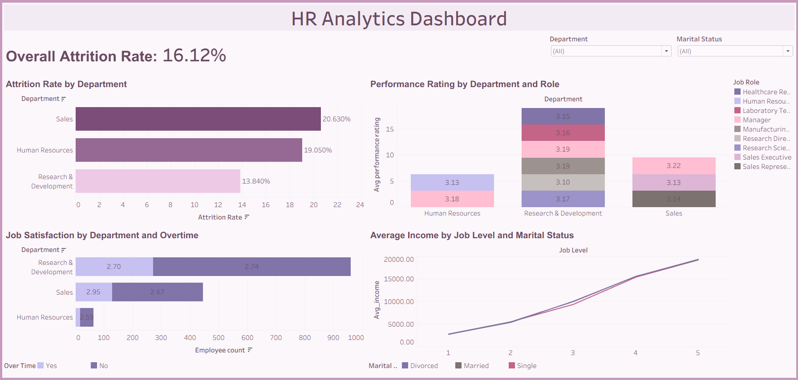

# HR Analytics Dashboard
A Tableau dashboard analyzing employee data from the [IBM HR Analytics Employee Attrition dataset](https://www.kaggle.com/datasets/pavansubhasht/ibm-hr-analytics-attrition-dataset). Built as part of my 4th SQL and Tableau portfolio project, it explores attrition, performance, job satisfaction and income trends.

## Features
- **KPI Card**: Overall attrition rate (16.12%).
- **Bar Chart**: Attrition rate by department.
- **Grouped Bar Chart**: Performance ratings by department and job role.
- **Stacked Bar Chart**: Job satisfaction by department and overtime status.
- **Line Chart**: Average income by job level and marital status.
- **Interactivity**: Department filter and click-based filtering for related visuals.

## Live Dashboard
Tableau Public: [[Insert Tableau Public URL](https://public.tableau.com/app/profile/vishal.d.silva/viz/HR_Analytics_Dashboard_17584926827140/HRAnalyticsDashboard)]

## Files
- `HR_Analytics_Dashboard.twbx`: Tableau workbook.
- `overall_attrition.csv`: Overall attrition rate.
- `attrition_by_department.csv`: Department-level attrition.
- `performance_by_dept_role.csv`: Performance by department and role.
- `satisfaction_by_dept_overtime.csv`: Satisfaction by department and overtime.
- `income_by_joblevel_marital.csv`: Income by job level and marital status.

## SQL Queries
The dashboard uses five SQL queries (see repository files or Tableau workbook for details).

## Tools
- **SQL**: MySQL Workbench for querying.
- **Tableau**: Tableau Public for visualization.
- **Dataset**: Kaggle HR Analytics dataset.

## Screenshots

